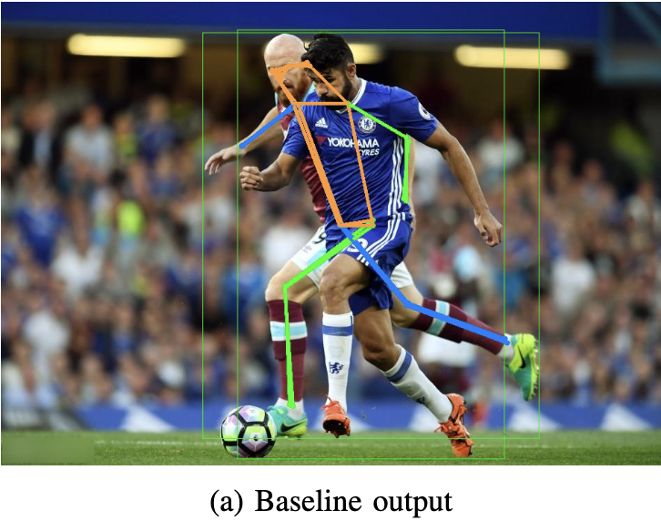
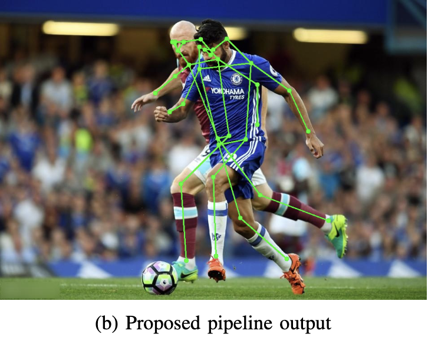
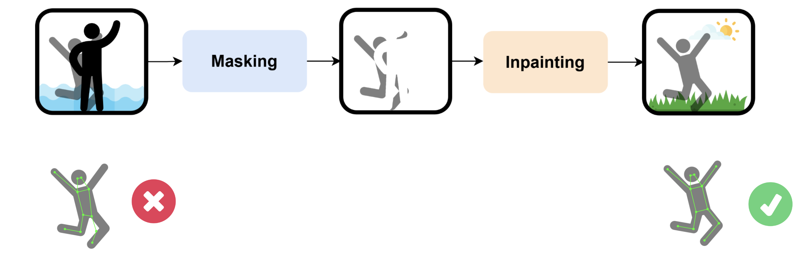

# I-COS: Leveraging Inpainting to Compensate for Occluded Skeleton
This branch contains the implementation of ***I-COS***.  
Keywords: pose estimation, inpainting, segmentation.

> Demo Link : [<a href="https://youtu.be/Hlj4yt-01kA">📹Video</a>]

## Visualization Result
<div align="center">
     
  </a>
    
  </a>
</div>
Fig 1. The visualization results of I-COS comparing to baseline without inpainting


## Method Overview

Fig 2. The pipeline of I-COS

This work is a method that segments human instances, uses inpainting to reconstruct missing body parts, and refines skeleton predictions. I-COS is a simple but effective pipeline for dealing with occlusions, achieving improvements over the baseline on the challenging OCHuman benchmark. 

## Getting Started
### Environment Setup
In order to run our pipeline using `demo.ipynb`  please follow all three environment setup requirements.
* **Segmentation - SAM2**

```
git clone https://github.com/facebookresearch/sam2.git && cd sam2
pip install -e .
pip install -e ".[notebooks]"
cd ./checkpoints && download_ckpts.sh
cd ..
pip install ultralytics
```
or
```
# Install sam2 directly from GitHub
pip install git+https://github.com/facebookresearch/sam2.git

# Install additional dependencies for notebooks (optional)
pip install "sam2[notebooks]"

# Install ultralytics
pip install ultralytics

cd /content
mkdir checkpoints
cd checkpoints
wget https://raw.githubusercontent.com/facebookresearch/sam2/main/checkpoints/download_ckpts.sh
sh download_ckpts.sh
```

  
* **Inpainting - BrushNet** 

First clone the repoistory
  
```
git clone https://github.com/TencentARC/BrushNet.git
```

Next, install diffusers using

```
pip install -e .

or

pip install diffusers==0.27.0
```

After that, you can install required packages thourgh:

```
cd examples/brushnet/
pip install -r requirements.txt
```


* **Pose Estimation - ViTPose**
```
!pip install mmcv==1.3.9
!pip install timm==0.4.9
!pip install einops
# Install ViTPose from GitHub
!pip install git+https://github.com/ViTAE-Transformer/ViTPose.git 
!pip install mmpose
```

### Model path setup
```
|-- <base_dir>
    |-- sam2
        |-- ...
        |-- checkpoints
            |-- sam2.1_hiera_large.pt
            |-- ...
            |-- download_ckpt.sh
        |-- ...
    |-- BrushNet
        |-- ...
        |-- data
            |-- ckpt
                |-- realisticVisionV60B1_v51VAE/ 
                |-- random_mask_brushnet_ckpt
    |-- ViTPose
        |-- ...
        |-- mmopose_configs
            |-- ViTPose_base_ochuman_256x192.py
        |-- ckpt
            |-- vitpose_base_coco_aic_mpii.pth
```

* The base model UNet for BrushNet and pretrained BrushNet checkpoint can be downloaded from [BrushNet](https://drive.google.com/drive/folders/1fqmS1CEOvXCxNWFrsSYd_jHYXxrydh1n?usp=drive_link).
* The ViTPose model checkpoint can be downloaded from [ViTPose-B](https://onedrive.live.com/?authkey=%21AMGk2fMQhRTN0o4&id=E534267B85818129%2125500&cid=E534267B85818129&parId=root&parQt=sharedby&o=OneUp).